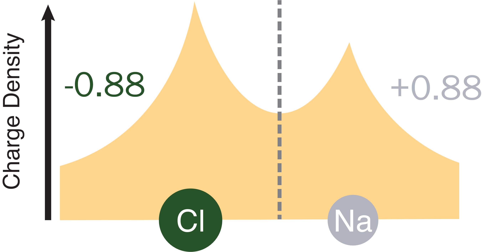

# Background and Methods

## Background
In chemistry and materials science, we often find ourselves talking about the 
oxidation state of a given atom. We discuss the atom as if it has taken or given 
exactly one electron. However, in real molecules and materials, the charge density 
is a smooth continuous function, and the electrons do not "belong" to any given atom. 
Indeed, the concept of oxidation states is not founded in quantum mechanics, and 
is effectively a tool invented by chemists through the years. Still, it 
is an exceptionally useful tool that allows for qualitative understanding of a 
vast array of concepts from bonding in organic molecules, to doping in metal alloys, 
to the charging of lithium ion batteries.

There have been many methods for calculating oxidation states proposed through
the years. One of the most popular was proposed by Bader in his Quantum Theory 
of Atoms in Molecules (QTAIM). This method relies solely on the charge density,
which is relatively insensitive to the choise of basis set used to approximate 
the wavefunction of the system, and is observable through experiment. 
In the QTAIM method, the charge is separated 
into regions by a surface located at local minima throughout the charge density. 
More technically, this "zero-flux" surface is made up of points where the gradient 
normal to the surface is zero.

We describe the regions defined by these surfaces as *basins*, though they are 
also commonly called *Bader regions*. Each basin has exactly one local maximum, 
sometimes termed an *attractor*. Each attractor typically (though not always) 
correspond to an atom, and the charge and oxidation state of the atom can be determined 
by integrating the charge density within this region.

In practice, it is often difficult and computationally expense to thoroughly 
sample the zero-flux surface defining basins. To avoid this problem, 
Henkelman et. al. proposed a brilliantly simple alternative utilizing the 
common representation of the charge density as points on a regular grid. 
Each point on the grid is assigned to a basin by climbing the 
steepest gradient until a local maximum is reached. Repeat gradient calculations 
can be avoided by stopping the ascent when a previously assigned path is reached. 
The end result is a robust and efficient method for dividing the charge density 
into basins, without ever needing to calculate the exact location of the zero-flux 
surface.

---

## Methods

Through the years, several methods for performing this steepest ascent have been
developed. We have implemented the same methods that exist in the Henkelman group's
excellent Fortran code. Here we provide brief descriptions for each method.
For a summary of the differences in our implementation vs. the original code
and benchmark tests, see our [Implementation FAQ](/baderkit/implementation).

| Method        | Speed   | Convergence Rate | Orientation Bias |
|---------------|---------|------------------|------------------|
|ongrid         |Very Fast|Slow              |Very High         |
|neargrid       |Very Fast|Slow              |Very Low          |
|weight         |Medium   |Very Fast         |Low               |
|neargrid-weight|Very Fast|Fast              |Very Low          |
    
=== "neargrid (default)"

    **Key Takeaway:** *Very fast, memory efficient, and potentially very accurate. 
    Requires a finer grid than the weight method.*
    
    This algorithm was developed by Henkelman et. al. after the ongrid method
    to fix orientation errors. It assigns each point on the grid to one basin,
    and its accuracy is therefore very dependent on the grid density.
    
    A gradient vector is calculated at each point using the three nearest neighbors. 
    A step is made to the neighboring point closest to this gradient vector. A
    correction vector pointing from the new point to the original gradient is
    calculated to preserve information about the true gradient.
    
    At each step, this correction vector is compounded. If any component of the 
    correction vector is ever closer to a neighboring point than the current one, 
    a correction is made to keep the path closer to the true gradient.
    
    After all of the points are assigned, a refinement must be made to the 
    points on the edge, as the accumulation of the gradient is technically only
    correct for the first point in the path.
    
    **Reference**
    
    W. Tang, E. Sanville, and G. Henkelman, A grid-based Bader analysis algorithm without lattice bias, [J. Phys.: Condens. Matter 21, 084204 (2009)](https://theory.cm.utexas.edu/henkelman/code/bader/download/tang09_084204.pdf)
    

=== "weight"
    
    **Key Takeaways:** *Converges at relatively rough grid densities, but is
    slower and requires more memory than the neargrid method.*
    
    This method converges quickly with grid density by allowing each point to
    be partially assigned to multiple basins. To reduce orientation errors, a
    voronoi cell is generated for each point on the grid to determine its nearest
    neighbors. A "flux" is calculated 
    from each point to its neighbors using the difference 
    in charge density modified by the distance to the neighbor and area of the 
    shared voronoi facet. The total flux is then normalized to determine the
    fraction of volume flowing to each neighbor.
    
    Moving from highest to lowest, each point is assigned to basins by assigning
    the fraction going to each neighbor to that neighbors own fractional assignments,
    creating a 'weight' corresponding to the portion of each point flowing to a
    given basin. The ordering from highest to lowest ensures that the higher neighbors have
    already received their assignment.
    
    
    **Reference**
    
    M. Yu and D. R. Trinkle, Accurate and efficient algorithm for Bader charge integration, [J. Chem. Phys. 134, 064111 (2011)](https://theory.cm.utexas.edu/henkelman/code/bader/download/yu11_064111.pdf)   

=== "ongrid"
    
    **Key Takeaways:** *Fast, but prone to orientation errors. We do
    not recommend using this method, but it is kept for historical reasons.*
    
    This is the original algorithm proposed by Henkelman et. al. It is very
    fast, but prone to error. It gives slightly different oxidation 
    states for different orientations of a molecule or material.
    
    For each point on the grid, the gradient is calculated for the 26 nearest 
    neighbors, and the neighbor with the steepest gradient is selected as the 
    next point in the path. This path is followed until a maximum is reached or
    a previous point in the path is hit. In the former case, all of the points in the path
    are assigned to the maximum, and in the latter they are assigned to the same
    maximum as the colliding path.
    
    **Reference**
    
    G. Henkelman, A. Arnaldsson, and H. Jónsson, A fast and robust algorithm for Bader decomposition of charge density, [Comput. Mater. Sci. 36, 354-360 (2006)](https://theory.cm.utexas.edu/henkelman/code/bader/download/henkelman06_354.pdf)

=== "neargrid-weight"

    **Key Takeaways:** *Similar speed and accuracy to the original neargrid method,
    but converges at lower grid densities.*
    
    This method is a hybrid of the neargrid and weight methods. It first runs the
    neargrid exactly, then uses the fractional assignment of the weight method
    to split the grid points at basin edges. The result is a method that requires
    minimal additional time over the original neargrid method, but with a
    convergence rate approaching that of the weight method.
    
    