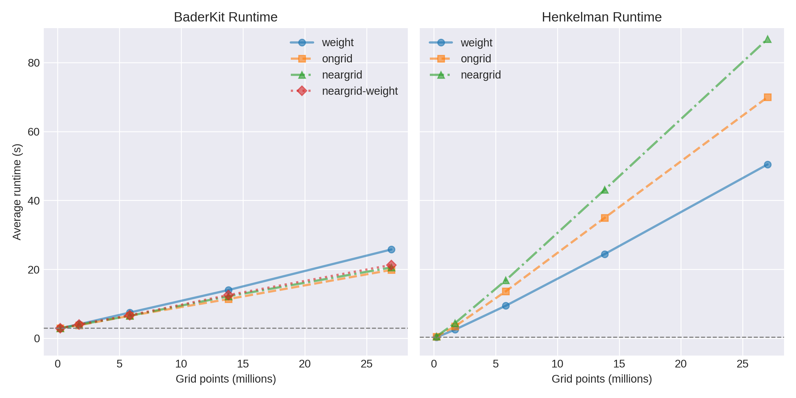
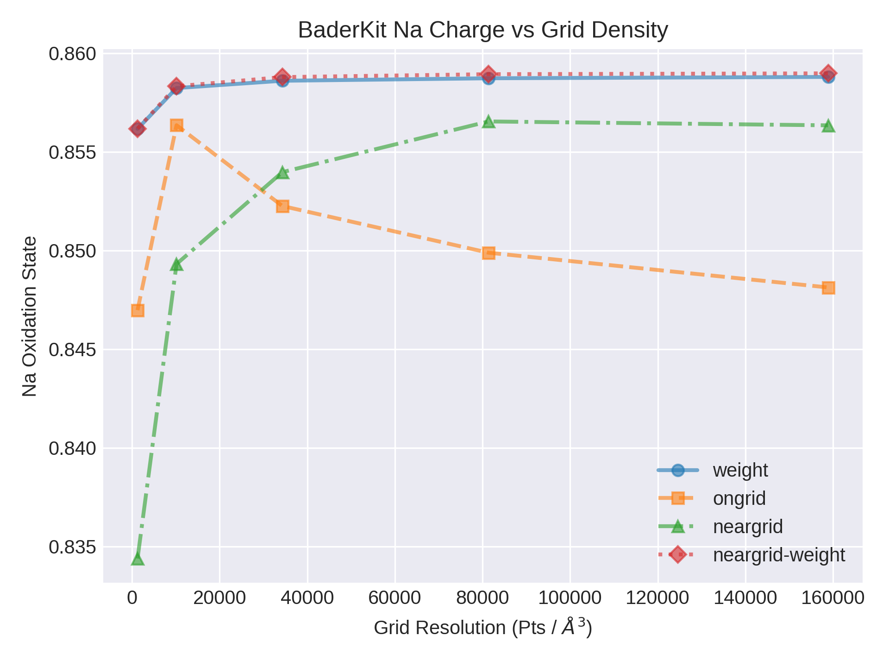
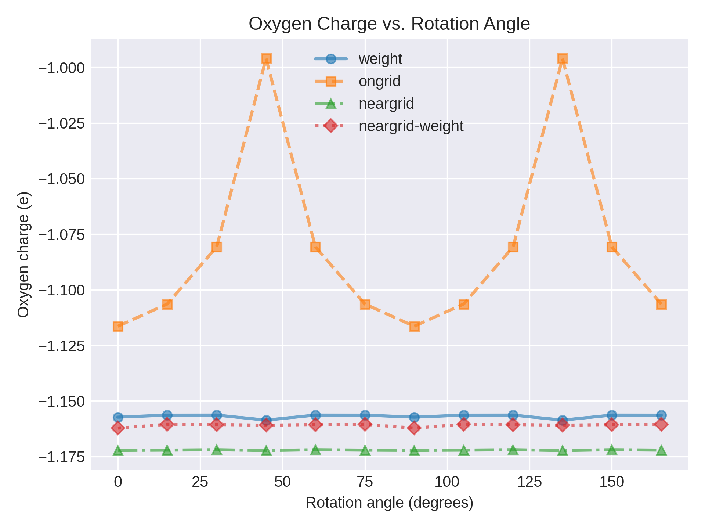

# Implementation FAQ

The BaderKit code is in general very different from the Henkelman group's 
Fortran code. Most of the changes are aimed at improving speed, especially
with Python in mind. Some of the changes aim to improve how Bader basins are
identified. These changes may result in basin charges/volumes that differ from
results obtained with the Henkelman group's code, but the final atom charges
and volumes should remain the same.

## Changes to All Methods

- **Maxima/Basin Reduction:** In highly symmetric systems it is common for
local maxima to be positioned exactly between two or more grid points. This
results in adjacent grid points with the same value. The Henkelman group's code
treats these as individual maxima/basins, while we combine them to a single maximum/basin.

- **Pointers Over Paths:** Except for in the `weight` method, the Henkelman code
typically starts at an arbitrary point and climbs a path to a maximum, assigning
points along the way. This is extremely fast as a serial operation, but is difficult
to parallelize due to the reliance on knowledge of previous traversed paths. We
instead prefer to assign pointers to each point in parallel, effectively constructing a
forest of trees with roots corresponding to basins. We then utilize a [pointer jumping](https://en.wikipedia.org/wiki/Pointer_jumping)
algorithm to efficiently find the roots.

- **Vacuum:** By default we remove grid points below a given tolerance, including
all negative values. The Henkelman group's code instead removes points with an
absolute value below this tolerance.

## Ongrid Changes

- **Parallelization:** As described above, we prefer to calculate pointers in
parallel and assign basins with a `pointer jumping` algorithm. In this method
we achieve this by calculating the steepest neighbor for each point in parallel
rather than the original method of following the steepest neighbors up a path
to a maximum.

## Neargrid Changes

- **Iterative Edge Refinement:** The original `neargrid` paper suggests
only one edge refinement is needed. We found this is sometimes not the case, and
several refinements may be needed to reach convergence. For example, the original
code assigns asymmetrical charges/volumes to symmetrical basins in our [test case](https://github.com/SWeav02/baderkit/tree/main/src/baderkit/tests/test_files).
We therefore use iterative refinement rather than a single refinement.

- **Parallelization:** The original method starts at an arbitrary point and constructs
a path traveling up the gradient, assigning points along the way. It then refines
the edges once, as they may be slightly misassigned. This refinement is necessary
because the gradient adjustments are only truly accurate for the starting point
in the path. We therefore abandon the initial assignment entirely, instead calculating
pointers to each points highest neighbor in parallel and reducing with a `pointer jumping` algorithm. 
These pointers differ from the `ongrid` method in that they are calculated using 
the gradient. The edges are then refined by performing the hill climbing for each
edge point in parallel. The result is identical to the original method with speed
comparable to the `ongrid` method.

## Weight Changes

- **Weight Basin Reduction:** The weight method uses a voronoi cell to determine 
neighbors and reduce orientation errors. This results in some points being 
labeled as maxima when they have a lower value than one of their 26 nearest neighbors. 
This results in many unrealistic basins which significantly slow down the calculation.
We remove these maxima by assigning them to true maxima using the ongrid method.

- **Parallelization:** Though the `weight` method involves calculating weights
that are dependent on one another, most of the components of the 'flux' used in
this calculation are independent. We take advantage of this and calculate the 
flux in parallel, greatly increasing speed. This comes at the cost of storing the 
information in memory using an array that is several times the size of the 
original grid.

- **Unknown Bug-fix:** We have found that in some cases, particularly in non-cubic
systems, the results of our method vary from the original. In particular we often
find fewer local maxima (prior to any maxima reduction). As an example, the
Henkelman code finds 8 local maxima in our [test system](https://github.com/SWeav02/baderkit/tree/main/src/baderkit/tests/test_files)
while our own code finds 6. After
careful examination, we are quite sure the 6 maxima are correct. We are unsure
what causes this bug, but it also appears to affect the calculated positions of
the basin maxima in the `BCF.dat` output for all systems and slightly affect the
calculated charges.

## Speed, Convergence, and Orientation

We have performed benchmark tests to compare our code's speed with the original
Fortran implementation. We also provide benchmarks on convergence and orientation
bias for each method.

The speed and convergence tests were run on a conventional cubic 8 atom NaCl
structure at varying grid densities. The charge density was calculated using the
Vieanna *Ab-initio* Simulation Package (VASP) with the PBE GGA density functional, an energy
cutoff of 372.85 eV, a 3x3x3 Monkhorst–Pack *k*-point mesh, and VASP's default
GW pseudo-potentials. The unit cell relaxed to a lattice size of 5.53 A.

The orientation tests were run on a water molecule in a cubic lattice with 270 grid points 
along each 8.04 A axis. Calculations were performed
using VASP, PBE GGA density functional, an energy cutoff of 400 eV, a 2x2x2
Monkhorst–Pack *k*-point mesh, and VASP's default PBE pseudo-potentials.

All bader calculations were performed using an Intel Core i9-9940X CPU with
14 cores (2 threads per core).

=== "Speed"
    
    Both the Henkelman group's code and BaderKit were called through the command-line
    to get an accurate speed comparison that encorporates the entire Bader workflow
    including file read/write, basin assignment, and atom assignment. The systematic
    increase in time for all BaderKit methods is due to the initialization of
    Python's interperator.
    
    
    
    Both the ongrid and neargrid method show improved scaling in BaderKit
    over the original code. In this system, the weight method is comparable, though
    we note the BaderKit method currently uses significantly more memory.
    
=== "Convergence"

    Convergence results were identical for both codes. As expected from the
    original papers, the `weight` method converges first, followed by the `neargrid`
    method then the `ongrid` method.
    
    
    
    
=== "Orientation"
    
    Orientation results were identical for both codes. Both the `weight` and
    `neargrid` methods show minimal variation with orientation of the molecule.
    
    
