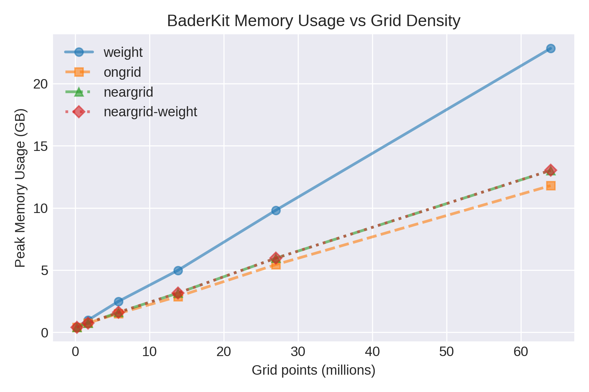

# Implementation FAQ

The BaderKit code is in general very different from the Henkelman group's 
Fortran code. This page provides benchmarks for the code as well as an overview
of differences between implementations.

---

## Benchmarks

=== "Speed"
    
    
    
    
    The plot above shows speed comparisons for running the BaderKit and Henkelman 
    group's code using the command line. This includes the file read/write,
    basin assignment, and atom assignment steps. The systematic
    increase in time for all BaderKit methods is due to the initialization of
    Python's interperator. In all cases, BaderKit shows comparable or improved
    speeds. The `neargrid-weight` method adds very little additional time compared
    with the original `neargrid` method.
    
=== "Convergence"    
    
    
    
    The plot above shows the oxidation state on a Na atom in a conventional
    NaCl crystal structure at increasing grid densities, calculated with each method. 
    As expected from their
    original papers, the `weight` method converges first, followed by the `neargrid`
    method then the `ongrid` method. Our own `neargrid-weight` method converges
    faster than the original `neargrid` method.
    
    The Henkelman group's code produces identical results and is therefore not shown.
    
=== "Memory"

    
    
    The plot above shows the maximum memory usage in MB of each method for a 
    given number of grid points. 
    
=== "Orientation"
    
    
    
    The plot above shows the oxidation state on the oxygen atom of a water
    molecule in vacuum. The `neargrid`, `weight`, and `neargrid-weight` methods
    show minimal variance with orientation, while the `ongrid` method shows fairly
    extreme bias.
    
    The Henkelman group's code produces identical results and is therefore not shown.
    
=== "Calculation Details"

    Speed and convergence tests were run on a conventional cubic 8 atom NaCl
    structure at varying grid densities. The charge density was calculated using the
    Vienna *Ab-initio* Simulation Package (VASP) with the PBE GGA density functional, an energy
    cutoff of 372.85 eV, a 3x3x3 Monkhorst–Pack *k*-point mesh, and VASP's default
    GW pseudo-potentials. The unit cell relaxed to a lattice size of 5.53 Å.
    The speed tests were run 10 times and the average taken to account for minor
    fluctuations in computational time.

    The orientation tests were run on a water molecule in a cubic lattice with 270 grid points 
    along each 8.04 Å axis. Calculations were performed
    using VASP, PBE GGA density functional, an energy cutoff of 400 eV, a 2x2x2
    Monkhorst–Pack *k*-point mesh, and VASP's default PBE pseudo-potentials.

    All bader calculations were performed using an Intel Core i9-9940X CPU with
    14 cores (2 threads per core).

---

## Implementation Differences

=== "All Methods"

    - **Maxima/Basin Reduction:** In highly symmetric systems it is common for
    local maxima to be positioned exactly between two or more grid points. This
    results in adjacent grid points with the same value. The Henkelman group's code
    treats these as individual maxima/basins, while we combine them to a single maximum/basin
    which we believe is more physically accurate.
    
    - **Pointers Over Paths:** Except for in the `weight` method, the Henkelman code
    starts at an arbitrary point and climbs a path to a maximum, assigning
    points along the way. This is extremely fast as a serial operation, but is difficult
    to parallelize due to the reliance on knowledge of previous traversed paths. We
    instead prefer to assign pointers from each point to its highest neighbor in parallel, 
    effectively constructing a forest of trees with roots corresponding to basins. 
    We then utilize a [pointer jumping](https://en.wikipedia.org/wiki/Pointer_jumping)
    algorithm to efficiently assign each point to its basin.
    
    - **Vacuum:** By default we remove grid points below a given tolerance, including
    all negative values. The Henkelman group's code instead removes points with an
    absolute value below this tolerance.

=== "Ongrid"

    - **Parallelization:** As described in [All Methods](/baderkit/implementation/#__tabbed_2_1), 
    we prefer to calculate pointers in
    parallel and assign basins with a `pointer jumping` algorithm. In this method
    we achieve this by calculating the steepest neighbor for each point in parallel
    rather than the original method of following the steepest neighbors up a path
    to a maximum.

=== "Neargrid"

    - **Iterative Edge Refinement:** The original `neargrid` paper suggests
    only one edge refinement is needed. We found this is sometimes not the case, and
    several refinements may be needed to reach convergence. For example, the original
    code assigns asymmetrical charges/volumes to symmetrical basins in our [test case](https://github.com/SWeav02/baderkit/tree/main/src/baderkit/tests/test_files).
    We therefore use iterative refinement rather than a single refinement.
    
    - **Parallelization:** The original method starts at an arbitrary point and constructs
    a path traveling up the gradient, assigning points along the way. It then refines
    the edges once, as they may be slightly misassigned. This refinement is necessary
    because the gradient adjustments are only truly accurate for the starting point
    in the path. We therefore abandon the initial assignment entirely, instead calculating
    pointers from each point to its highest neighbor in parallel and reducing with a `pointer jumping` algorithm. 
    These pointers differ from the `ongrid` method in that they are calculated using 
    the gradient. The edges are then refined by performing the tru hill climbing for each
    edge point in parallel. The result is identical to the original method with speed
    comparable to the `ongrid` method.

=== "Weight"

    - **Weight Basin Reduction:** The weight method uses a voronoi cell to determine 
    neighbors and reduce orientation errors. This results in some points being 
    labeled as maxima when they have a lower value than one of their 26 nearest neighbors. 
    This results in many unrealistic basins which can significantly slow down the calculation.
    We remove these maxima by assigning their full weight to the highest neighbor.
    
    - **Parallelization:** Though the `weight` method involves calculating weights
    that are dependent on one another, most of the components of the 'flux' used in
    this calculation are independent. We take advantage of this and calculate the 
    flux in parallel. This comes at the cost of storing the 
    information in memory using an array that is several times the size of the 
    original grid.
    
    - **Unknown Bug-fix:** We have found that in some cases, particularly in non-cubic
    systems, the results of our method vary from the original. In particular we often
    find fewer local maxima (prior to any maxima reduction). As an example, the
    Henkelman code finds 8 local maxima in our [test system](https://github.com/SWeav02/baderkit/tree/main/src/baderkit/tests/test_files)
    while our own code finds 6. After
    careful examination, we are quite sure the 6 maxima are correct. We are unsure
    what causes this bug, but it also appears to affect the calculated positions of
    the basin maxima in the `BCF.dat` output for all systems and slightly affect the
    calculated charges in many systems.

