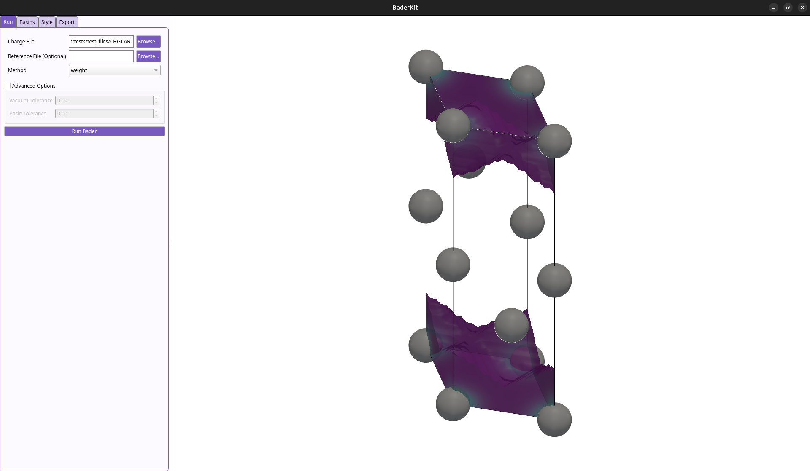

# Quick Start

BaderKit reproduces the methods for Bader charge analysis available in the 
[Henkelman group's](https://theory.cm.utexas.edu/henkelman/code/bader/) excellent 
Fortran code within the Python ecosystem. It is built on
top of the [PyMatGen](https://pymatgen.org/) package, allowing for
easy extension to other projects. Under the hood, BaderKit runs on [Numba](https://numba.pydata.org/numba-doc/dev/index.html) 
and [NumPy](https://numpy.org/doc/stable/index.html) to parallelize and vectorize
calculations. This allows BaderKit to reach speeds [comparable or faster](/baderkit/implementation/#__tabbed_2_1)
than the original code.

---

## Installation

=== "conda (recommended)"
    If you haven't already, install a conda environment manager such as [Anaconda](https://www.anaconda.com/download).
    
    1. Create a conda environment using the following command in your terminal.
    Replace `my_env` with whatever name you prefer.
    ```bash
    conda create -n my_env
    ```
    2. Activate your environment.
    ```bash
    conda activate my_env
    ```
    3. Install BaderKit.
    ```bash
    conda install -c conda-forge baderkit
    ```
    4. Confirm the install by running the help command.
    ```bash
    baderkit --help
    ```

=== "pip"
    We generally recommend using a virtual environment manager such as
    [Anaconda](https://www.anaconda.com/download) or [venv](https://docs.python.org/3/library/venv.html)
    to keep your Python work environments isolated. If you don't want to,
    you can still use pip so long as Python is installed.
    
    1. Install BaderKit with the following command in your terminal.
    ```bash
    pip install baderkit
    ```
    2. Confirm the install by running the help command
    ```bash
    baderkit --help
    ```
        
=== "GUI App (Optional)"

    In addition to the core package, there is an optional GUI feature which allows
    for easy viewing and plotting of results. This requires extra dependencies which
    can be installed through pip.
    
    ```bash
    pip install baderkit[gui]
    ```
    
    !!! Note
        This is kept as optional as the GUI requires significantly more dependencies
        than the base app. Unfortunately, this means conda cannot
        be used, as it does not allow for optional dependencies.

---

## Basic Use

Once installed, BaderKit can be used through the command line interface or through
Python script. This page covers only the most simple use case of running 
Bader charge analysis on a VASP `CHGCAR` or Gaussian `cube` file. For more 
advance usage, see our [API reference](/baderkit/api_reference/core/bader) 
and [Examples](/baderkit/examples) pages.


=== "Command Line"

    1. Activate your environment with BaderKit installed. If you are not using an
    environment manager, skip to step 2.
    
        ```bash
        conda activate my_env
        ```
        
    2. Navigate to the directory with your charge density file.
    
        ```bash
        cd /path/to/directory
        ```
    
    3. Run the bader analysis. Replace 'chargefile' with the name of your file.
    
        ```bash
        baderkit run chargefile
        ```
    
    Output files for atoms and bader basins will be written automatically to 
    `bader_atom_summary.tsv` and `bader_basin_summary.tsv` respectively. Each file includes:

    - atom label
    - coordinates (fractional) 
    - charge (*e*) 
    - volume (Å<sup>3</sup>)
    - minimum surface distance (Å)
    - nearest atom (Å) <small>**basins only**</small>
    
    Additional arguments and options such as those for printing output files or using different 
    algorithms can be viewed by running the help command.
    ```bash
    baderkit run --help
    ```

=== "Python"
    
    1. The core functionality of BaderKit revolves around the `Bader` class. First, import the `Bader` class.
    
        ```python
        from baderkit.core import Bader
        ```
    
    2. Use the `Bader` class' `from_dynamic` method to read a `CHGCAR` or `cube`
    file.
    
        ```python
        # instantiate the class
        bader = Bader.from_dynamic("path/to/charge_file")
        ```
    
    3. To run the analysis, we can call any class property. Try getting a complete
    summary in dictionary format.
        ```python
        results = bader.results_summary
        ```
    
    4. Now try getting individual properties. For more details on each property,
    see the [API reference](../api_reference/core/bader/#src.baderkit.core.bader.Bader).
        ```python
        atom_charges = bader.atom_charges # Total atom charges
        atom_labels = bader.atom_labels # Atom assignments for each point in the grid
        basin_volumes = bader.basin_volumes # The volumes of each bader basin
        maxima_coords = bader.basin_maxima_frac # Frac coordinates of each attractor
        ```
    
    5. BaderKit also provides convenience methods for writing results to file. First,
    let's write a summary of the full analysis.
    
        ```python
        bader.write_results_summary()
        ```
    
    6. Now let's write the volume assigned to one of our atoms.
    
        ```python
        bader.write_atom_volumes(atom_indices = [0])
        ```
    
    !!! Tip
        After creating a `Bader` class object, it doesn't matter what order
        you call properties, summaries, or write methods in. BaderKit calculates
        properties/results only when they are needed and caches them.

=== "GUI App"

    1. Activate your environment with BaderKit installed. If you are not using an
    environment manager, skip to step 2.
    
        ```bash
        conda activate my_env
        ```
    
    2. Run the BaderKit GUI.
        ```bash
        baderkit gui
        ```
        
        This will launch a new window:
        

    3. Browse to find you charge density file, select your method, and run!

---

## Warning for VASP (And other pseudopotential codes)

VASP and other pseudopotential codes only include the valence electrons
in their charge density outputs. In VASP, there is an option to write out the
core electron density by adding the tag `LAECHG=.TRUE.` to your `INCAR` file.

This will write the core charge density to an `AEECAR0` file and the valence 
to `AECCAR2` which can be summed together to get a total charge density that
is much more accurate for partitioning. **We highly recommend doing this**.

=== "Command Line"
    1. Sum the files using BaderKit's convenience method.
    ```bash
    baderkit sum AECCAR0 AECCAR2
    ```
    2. Run the analysis using this total charge density as the reference for
    partitioning.
    ```bash
    baderkit run CHGCAR -ref CHGCAR_sum
    ```
    
=== "Python"
    1. Import the Bader and Grid classes.
    ```python
    from baderkit.core import Bader, Grid
    ```
    2. Load the CHGCAR, AECCAR0 and AECCAR2
    ``` python
    charge_grid = Grid.from_vasp("CHGCAR")
    aeccar0_grid = Grid.from_vasp("AECCAR0")
    aeccar2_grid = Grid.from_vasp("AECCAR2")
    ```
    3. Sum the AECCAR files
    ```python
    reference_grid = aeccar0.linear_add(aeccar2_grid)
    ```
    4. Create the bader object
    ```python
    bader = Bader(
        charge_grid = charge_grid,
        reference_grid = reference_grid
        )
    ```
    From here, the `Bader` class object can be used as described in the [Basic Use](/baderkit/#__tabbed_2_2)
    section.

!!! Warning
    A fine grid is needed to accurately reproduce the core charge density. We
    have found that a grid density of ~22 pts/Å along each lattice vector (~10000 pts / Å<sup>3</sup>) is
    fine enough in most cases, but we generally recommend testing an
    increasing set of grid densities until convergence is reached.
