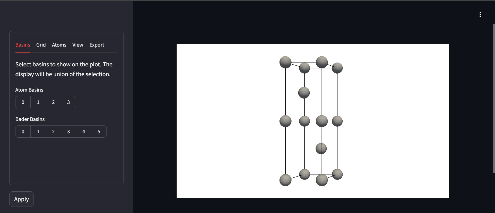

BaderKit can be used in three main ways.

1. Through python scripts
2. Through the command line
3. Through an interactive app in your browser

Python allows for more extensive logic to be used with the results, the command line is quick and convenient, and the web app allows for quick visualization.

## Python
### The Bader Class
The original goal of this project was to make the results of Bader analysis more readily available for further analysis down the line. The core functionality is found in the `Bader` class, which can be readily created by providing the path to a VASP `CHGCAR`/`ELFCAR` or a `.cube` file.

```python
from baderkit.core import Bader
from pathlib import Path

# instantiate the class
bader = Bader.from_dynamic(
    charge_filename = "path/to/charge_file",
    reference_filename = "path/to/charge_file", # Optional
    method = "neargrid", # Optional. Also ongrid, weight, or hybrid-weight
    directory = Path("path/to/somewhere") # Optional
    )
```

Results are stored as class properties. To get make the algorithm run and get a summary of results, run:

```python
results = bader.results_summary
```
Individual results can also be obtained directly. For example:
```python
atom_charges = bader.atom_charges # Total atom charges
atom_labels = bader.atom_labels # Atom assignments for each point in the grid
basin_volumes = bader.basin_volumes # The volumes of each bader basin
maxima_coords = bader.basin_maxima_frac # Frac coordinates of each attractor
```

Results can also be written to file, similar to the Henkelman code. `write_results_summary` will write the bader basins and atomic basins to two `.tsv` files which are human readable and can be opened with spreadsheet programs like excel. VASP-like files for individual atoms/basins or a sum of them can be written as well. If no directory is provided, these will write to the directory provided when the class was first instanced.
```python
bader.write_results_summary() # writes results to .tsv files
bader.write_basin_volumes([0]) # writes each basin in a list
bader.write_atom_volumes_sum([0,1,2]) # writes the union of atomic basins

```

### The Grid Class
The `Bader` class only has convenience functions for loading VASP or .cube files. For other formats, it must be created from BaderKit's custom Grid class. Behind the scenes, the Grid class inherits from Pymatgen's [VolumetricData class](https://pymatgen.org/pymatgen.io.vasp.html#pymatgen.io.vasp.outputs.VolumetricData). The `Grid` class can be created directly from a Pymatgen Structure and a dictionary of Array's representing the Charge Density.

```python
from baderkit.core import Bader, Grid, Structure
from pathlib import Path
import numpy as np

# load a Structure object
structure = Structure.from_file(filename = "POSCAR", fmt = "POSCAR")

# Load your data, however you can, into a numpy array
charge_data = np.array([
[[1,2,3],[3,4,5],[6,7,8]],
[[1,2,3],[3,4,5],[6,7,8]],
[[1,2,3],[3,4,5],[6,7,8]],
])

# Create a data dictionary
data = {"total": charge_data}

# create Grid objects for the charge-density and reference file
charge_grid = Grid(structure=structure, data=data)

# Create the Bader object
bader = Bader(charge_grid = charge_grid)
```

!!! Note
    For spin-polarized calculations, the data dictionary should have two entries, `total` and `diff` containing the (spin-up + spin-down) data and (spin-up - spin-down) data respectively.

### For VASP Users (And other pseudopotential codes)
VASP's CHGCAR contains only the valence electrons designated in the pseudopotential (PP) used for the calculation. It is generally recommended to recombine the valence charge density with the core density to use as the reference file. To do this, add the tag `LAECHG=.TRUE.` to the `INCAR` file. This will write the core charge density to an `AEECAR0` file and the valence to `AECCAR2`. These can be summed together using the `Grid` class and then used as the reference file for the analysis.

```python
from baderkit.core import Bader, Grid

# load the standard charge density
charge_grid = Grid.from_vasp("CHGCAR")

# load the AECCAR0 and AECCAR2
aeccar0_grid = Grid.from_vasp("AECCAR0")
aeccar2_grid = Grid.from_vasp("AECCAR2")

# sum the grids
reference_grid = Grid.sum_grids(
    grid1 = aeccar0_grid, 
    grid2 = aeccar2_grid
    )

# create the bader object
bader = Bader(
    charge_grid = charge_grid,
    reference_grid = reference_grid
    )
```

## Command Line
In addition to the Python interface, BaderKit can be run from the command line. In most cases the commands mimic those from the Henkelman group's code. For basic use:

1. Activate your environment with BaderKit installed
2. Navigate to the directory with your charge density and reference file
3. Run 
   ```bash
   baderkit run CHGCAR -ref CHGCAR_sum
   ```

Output files for atoms and bader basins will be written automatically to `bader_atom_summary.tsv` and `bader_basin_summary.tsv` respectively. Additional arguments and options such as those for printing output files or using different algorithms can be viewed by running 
```bash
baderkit run --help
```

There is also a convenience command for combining two grid files. This essentially runs the script above.
```bash
baderkit tools sum AECCAR0 AECCAR2
```

## Web GUI

Writing bader basins to file without knowing what they are can be annoying. To help with this, we have the `BaderPlotter` class which uses [pyvista](https://pyvista.org/) under the hood. This can be interacted with in python directly, or through a relatively basic web app created with [Streamlit](https://streamlit.io/). The app can be started from the command line with:
```bash
baderkit tools webapp CHGCAR -ref CHGCAR_sum
```

This will open a window in your browser similar to this:


The atom and bader basins can be selected using the `Bader` tab on the left. Simple settings for the isosurface and atoms are available under the `Grid` and `Atoms` tab. Some settings for the viewport are available under the `view` tab. The selected basins can be exported to vasp-like files in the folder you started the webapp from under the `Export` tab. The viewport can also be exported to a variety of image formats.

!!! Warning
    Currently the viewport is made by exporting the pyvista Plotter object to html and embedding it directly. Changes made by interacting with the view port directly (rotation) will not show up in exported images, and the image may flash when the apply button is clicked.
