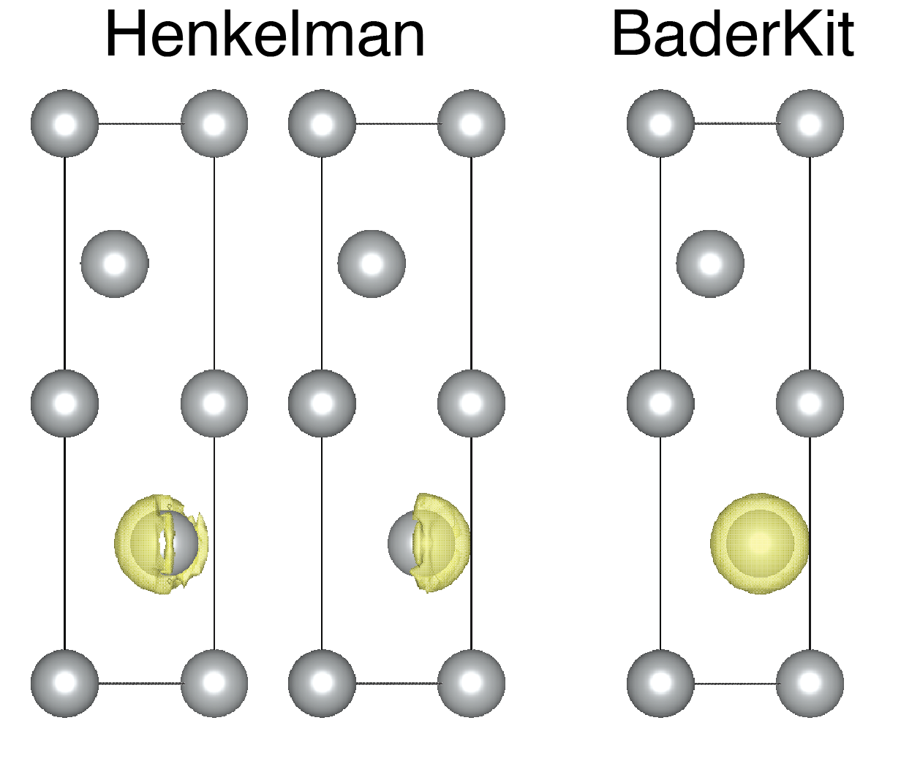

# Summary

The concept of oxidation states has existed for centuries, guiding and informing the decisions of generations of scientists. However, oxidation states are not observable, and cannot be uniquely derived from first principle calculations. This has led researchers to develop a variety of methods to recover oxidation states, each with their own unique theory and methodology. Chief among these methods is that described by Bader in his Quantum Theory of Atoms in Molecules, which derives oxidation states directly from a systems electron charge density. Though there are several popular implementations of this method, they are either outdated or slow. The `BaderKit` package brings Bader charge analysis into the modern Python ecosystem, reworking the most popular grid-based algorithms to run in parallel.

# Statement of need

Bader charge analysis is among the most widely used methods in chemistry and materials science, with thousands of articles referencing the method each year. By far the most popular implementation is the code developed by the Henkelman group at UT Austin [@Henkelman:2006]. While fast and memory-efficient, the code is written in Fortran making it cumbersome to incorporate into modern workflows. It is well over a decade old and was not designed for modern multi-threaded CPUs. There have been some previous attempts to alleviate these issues. In particular, `pybader` [@pybader] partially implemented the method into parallelized Python code. However, `pybader` is typically slower than the original code and requires a significant amount of boilerplate code. `BaderKit` aims to improve upon the areas where the original Fortran code and `pybader` fall short. It is fast, extensive, easy to use, and designed to be easily inserted into modern workflows.

# Implementation Details

`BaderKit` runs directly on the output of many of the most popular density functional theory codes (e.g. VASP [@Kresse:1996], Gaussian [@gaussian], Quantum Espresso [@Giannozzi:2009]), and can be easily extended to run on the output of other codes. It is built on top of the well-established `PyMatGen` package, allowing for seamless integration into complex workflows. To reach speeds comparable to Fortran, `BaderKit` uses the `Numba` [@Lam:2015] and `NumPy` [@harris:2020] packages to compile expensive operations to machine code and allow for fast, C-based, vectorized calculations. `Numba's` auto-parallelization tool is used extensively to further improve speed on modern multi-core machines. For easier implementation into workflows, `BaderKit` builds its core classes off of the popular materials science package, `PyMatGen` [@Ong:2013]. In addition to the Python interface, `BaderKit` includes a command-line interface built with the `Typer` [@typer] package for quick one-off calculations, and a simple desktop application built with `PyQt5` [@PyQt5] and `PyVista` [@Sullivan:2019] for visualization.

## Speed and Parallelization

BaderKit includes each of the algorithms from the original Fortran code including the `ongrid` [@Henkelman:2006], `neargrid` [@Henkelman:2009], and `weight` [@Yu:2011] methods. On a modern machine (AMD Ryzen™ Threadripper™ 1950X CPU with 16 cores), `BaderKit` runs two to three times as fast as the original Fortran code (\autoref{fig:fig1}). This speedup is primarily due to changes made to each method that allow them to be parallelized on multi-core architectures. Here, we briefly touch on the most significant changes.

The original `ongrid` and `neargrid` methods perform hill climbing algorithms that start at arbitrary points and climb the steepest gradient until either a maximum or previous point is reached. The `ongrid` method is fast, but its results are highly dependent on the rotational orientation of the system. The `neargrid` method is similar, but improves upon this by storing a correction vector from the current point to the true gradient and making adjustments when the vector is sufficiently large. It requires an additional edge refinement step as the correction vector is only correct for the initial starting point of the path. Instead of a path-building method, `BaderKit` loops over each point in parallel and establishes a pointer to the steepest neighbor. This creates a classic 'forest of trees' problem where the root of each tree corresponds to a Bader basin. `BaderKit` then finds these roots using a vectorized pointer jumper algorithm. For the `neargrid` method, the points along the edge are then iteratively refined in parallel using the original path method. This operation is significantly sped up by caching the gradients calculated during the initial pointer construction.

In contrast to the `ongrid` and `neargrid` methods, the `weight` method allows points to be assigned to multiple Bader basins. In the original algorithm, the points are sorted then looped over from high to low values. At each point, the algorithm calculates a flux representing the fraction of the point flowing to each of its neighbors, then uses the results from those neighbors to calculate the fraction of the point flowing to each basin. Though the loop from high to low must be done serially, `BaderKit` improves upon the original by calculating the fluxes in parallel. Because, this flux is only important at points that straddle multiple basins, `BaderKit` performs an initial fast loop that assigns interior points without calculating the flux. Additionally, we have developed a new hybrid method we call `neargrid-weight`. Since only the flux at basin edges is important, we first find interior points using the faster, fully parallelized `neargrid` method, then obtain fractional assignments at the edges using the `weight` method.

## Basin Reduction

In addition to improved speed, BaderKit fixes an issue in the original codes handling of local maxima. In highly symmetrical systems, it is common for a local maximum to sit precisely between two or more grid points. This results in multiple adjacent points with values greater than or equal to their neighbors. In the original Fortran code, these points are incorrectly considered separate maxima. `BaderKit` explicitly checks for this, combines adjacent maxima, and performs a quick refinement using a parabolic fit to estimate the true, offgrid, location of the maxima (\autoref{fig:fig2}). This adds negligible time, and results in more physically reasonable basins.

{ width=50% }

# Use in Other Codes

`BaderKit` is designed to simplify the creation of complex charge and topology analysis workflows. It has already been implemented in the `BadELF` code, a method designed for charge analysis in electride materials [@Weaver:2023]. It is easy to use, efficient, and runs on most popular operating systems (e.g. Windows, MacOS, Ubuntu, etc.). `BaderKit` will allow researchers to build complex charge and topology analysis software, all within the modern Python ecosystem.

# Acknowledgements

S.M.W. acknowledges support of this research by the NSF Graduate Research Fellowship Program.
While developing this software, computational resources were provided, in part, by the Research Computing Center at the University of North Carolina at Chapel Hill.

# References